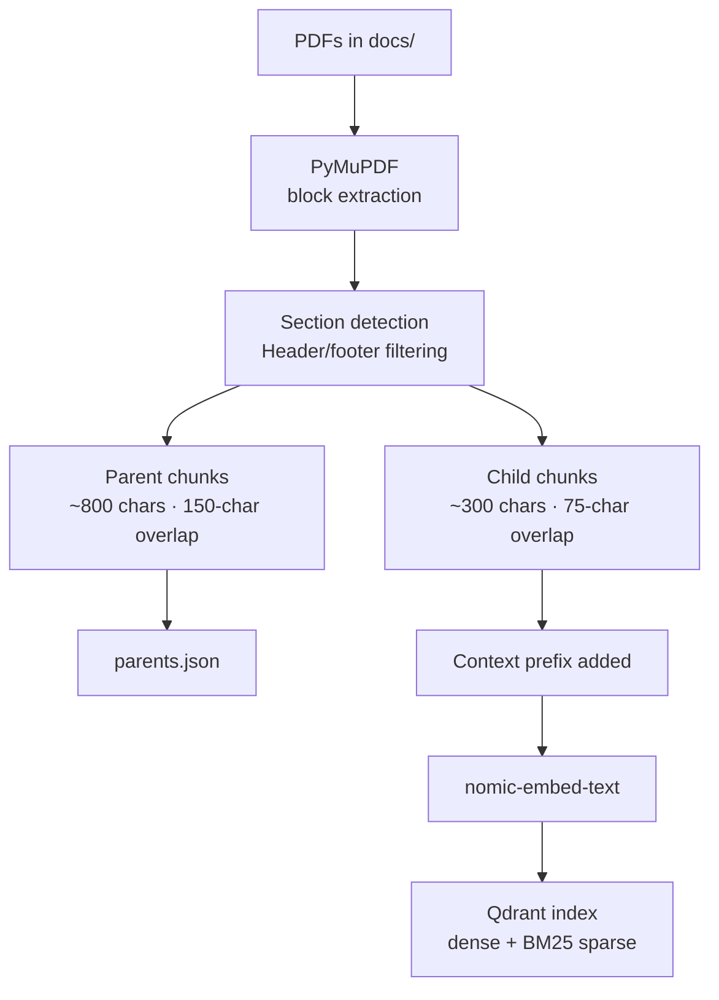
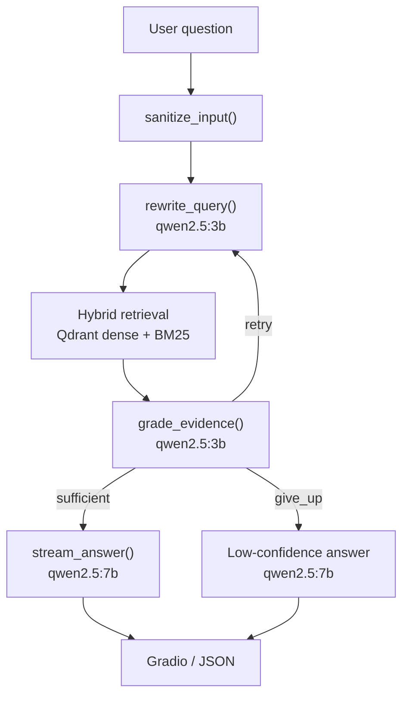
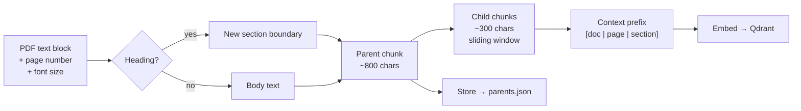
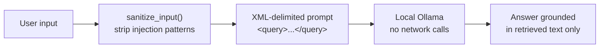

# NDA Agentic RAG

Local NDA question-answering. PDFs in, cited answers out, nothing leaves the machine.

Built for the [Kleister NDA](https://github.com/applicaai/kleister-nda) dataset as a take-home coding challenge for an Agentic Coding Developer role.

---

## Contents

1. [At A Glance](#at-a-glance)
2. [Architecture](#architecture)
3. [Stack](#stack)
4. [Quick Start](#quick-start)
5. [Docker](#docker)
6. [Chunking](#chunking)
7. [Self-Correction](#self-correction)
8. [Example Output](#example-output)
9. [Evaluation](#evaluation)
10. [Acceptance Criteria](#acceptance-criteria)
11. [Security](#security)
12. [FAQ](#faq)

---

## At A Glance

**What it does**

* Answers questions over NDA PDFs
* Cites document, page, chunk, and snippet for every claim
* Labels each piece of evidence as `direct`, `inferred`, or `absent`
* Retries with a targeted query when the first retrieval is weak
* Streams the answer token by token so the UI feels responsive
* Shows the full reasoning trace in a Gradio dashboard

**What it avoids**

* No external LLM APIs
* No telemetry or cloud services
* No confident answers when evidence is missing
* No data leaving the machine

---

## Architecture

### Ingestion



### Query flow



---

## Stack

| Component | Choice | Role |
|---|---|---|
| LLM | qwen2.5:7b-instruct (Ollama) | Final answer generation |
| Fast model | qwen2.5:3b (Ollama) | Rewrite, grade, classify |
| Embeddings | nomic-embed-text (Ollama) | 768-dim, local |
| Vector DB | Qdrant | Dense + sparse search |
| PDF parsing | PyMuPDF | Block-level, keeps page metadata |
| UI | Gradio | 3-tab debug dashboard |
| Runtime | Python 3.11 + Docker Compose | |

---

## Quick Start

**Prerequisites:** [Ollama](https://ollama.com) installed and running.

**macOS / Linux**

```bash
# 1. Pull models
ollama pull qwen2.5:7b-instruct
ollama pull qwen2.5:3b
ollama pull nomic-embed-text

# 2. Install dependencies
cd nda_rag
python3 -m venv .venv && source .venv/bin/activate
pip install -r requirements.txt

# 3. Drop PDFs into docs/ then index
python3 ingest.py

# 4. Launch dashboard
python3 app.py
```

**Windows**

```powershell
# 1. Pull models
ollama pull qwen2.5:7b-instruct
ollama pull qwen2.5:3b
ollama pull nomic-embed-text

# 2. Install dependencies
cd nda_rag
python -m venv .venv && .venv\Scripts\activate
pip install -r requirements.txt

# 3. Drop PDFs into docs\ then index
python ingest.py

# 4. Launch dashboard
python app.py
```

Open [http://localhost:7860](http://localhost:7860).

**Ingestion modes** (`config.py`):

| Setting | Speed | Quality |
|---|---|---|
| `CONTEXTUAL_ENRICHMENT = False` | Fast, no LLM calls | Good (deterministic prefix) |
| `CONTEXTUAL_ENRICHMENT = True` | Slow, ~1-2s per chunk | Better (LLM-written context) |

---

## Docker

Three services, one command:

```bash
docker-compose up
```

After startup, pull models and index:

```bash
docker exec -it <ollama-id> ollama pull qwen2.5:3b
docker exec -it <ollama-id> ollama pull nomic-embed-text
docker exec -it <app-id> python3 ingest.py
```

> Docker defaults to `qwen2.5:3b` for both LLM roles. See [Why is Docker inference slow on Mac?](#why-is-docker-inference-slow-on-mac) in the FAQ.

---

## Chunking



* Small child chunks keep search precise
* Large parent chunks give the LLM enough context to answer
* Page numbers stay attached so citations are exact
* Sliding window overlap prevents clauses from splitting at chunk edges

---

## Self-Correction

Up to three attempts per question (`MAX_RETRIES` in `config.py`).

After each retrieval the grader returns:

```python
class GradeResult(BaseModel):
    relevance_score: float                          # 0.0 – 1.0
    coverage: Literal["full", "partial", "none"]
    missing_aspects: list[str]                      # e.g. ["jurisdiction clause"]
    decision: Literal["sufficient", "retry", "give_up"]
```

On `retry`, `missing_aspects` feeds into the next query rewrite. The second search targets the specific gap rather than repeating the original question. A Pydantic model is used here so the control flow is deterministic, not dependent on parsing free text.

---

## Example Output

**Question:** Which parties are involved and what are their roles?

```json
{
  "answer": "The agreement is between Acme Corp ('Disclosing Party') and Beta GmbH ('Receiving Party').",
  "confidence": "high",
  "evidence": [
    {
      "document": "nda_001.pdf",
      "page": 1,
      "chunk_id": "nda_001_p1_a3b2c1d4_c0",
      "snippet": "...entered into by and between Acme Corp (the 'Disclosing Party')...",
      "support": "direct"
    }
  ],
  "self_correction": [
    {
      "step": 1,
      "action": "initial_retrieval",
      "query": "parties to the NDA and their roles",
      "relevance_score": 0.81,
      "coverage": "full",
      "missing_aspects": [],
      "decision": "sufficient"
    }
  ]
}
```

* `confidence` shows how well-supported the answer is
* `evidence` shows exactly where the answer came from
* `support` separates direct quotes from inferences from missing information
* `self_correction` shows whether a retry was needed and why

---

## Evaluation

```bash
python3 evaluate.py --dataset /path/to/kleister-nda --split dev-0 --limit 20
```

Computes F1 for `effective_date`, `jurisdiction`, `party`, and `term` plus an overall score. Use `--reset` for a clean index before a run.

---

## Acceptance Criteria

**Product**

1. Fully local, no external API calls
2. Every answer cites at least one `direct` or `inferred` evidence item
3. Missing evidence is `"support": "absent"` and `"confidence": "low"`, never a confident wrong answer
4. Citations include document name, page number, and a text snippet
5. Responses match the documented JSON schema

**Engineering**

1. Each pipeline stage is independently readable and testable
2. `config.py` is the single place to change models, paths, chunk sizes, and feature flags
3. `parse_status.json` surfaces extraction failures without crashing ingestion
4. `evaluate.py` produces a reproducible F1 score on a held-out split

---

## Security



* `sanitize_input()` strips known injection patterns before any prompt is built
* User text is wrapped in XML delimiters so it cannot escape its boundary
* The model is instructed to refuse queries outside NDA analysis
* All services are local by default

---

## FAQ

<details>
<summary>Why local-only?</summary>

- Datenschutz: German SME clients will not send NDA text to a cloud API
- NDA documents are confidential by definition
- Runs on a company laptop or a small rented server, nothing leaves the network

</details>

<details>
<summary>What was the starting inspiration?</summary>

[agentic-rag-for-dummies](https://github.com/GiovanniPasq/agentic-rag-for-dummies) — clean LangGraph pipeline with hierarchical indexing and a self-correction loop.

What stayed: parent/child chunking, LangGraph orchestration, agent retry loop.

What changed:

| agentic-rag-for-dummies | this project |
|---|---|
| PDF → Markdown | PyMuPDF block extraction, page metadata kept |
| Markdown header-based parents | Font-size section detection + sliding window |
| Conversation memory | Removed — single-turn |
| Human-in-the-loop clarification | Removed — adds latency, not needed |
| Multi-agent map-reduce | Removed — overkill for focused NDA questions |
| Context compression loops | Removed — no benefit at this scale |
| Cloud LLM optional | Local-only, no exceptions |

</details>

<details>
<summary>Why PyMuPDF instead of converting PDFs to Markdown?</summary>

- The challenge requires page numbers in every citation — Markdown conversion loses them
- Kleister NDA PDFs are generated from HTML via Puppeteer, so font sizes are consistent and section detection from font metadata is reliable
- Block-level extraction keeps the document structure intact for hierarchical chunking

</details>

<details>
<summary>Why was chunking the main focus?</summary>

Bad chunking breaks retrieval in ways prompt engineering cannot fix.

- Parent/child split: small chunks for search precision, large chunks for answer context
- Sliding window overlap (75-char child, 150-char parent): clause boundaries do not land at chunk edges
- Header/footer filtering: repeated short blocks stripped before indexing
- Context prefix on every child chunk before embedding: improves retrieval for small local models

</details>

<details>
<summary>What was deliberately skipped?</summary>

- **Conversation memory** — NDA analysis is single-turn; prior questions do not help retrieve the next passage
- **Human-in-the-loop clarification** — adds latency with no retrieval benefit
- **Multi-agent map-reduce** — useful for decomposing complex questions across many documents, not needed here
- **Context compression loops** — no measurable benefit at 83 documents and three retry attempts

</details>

<details>
<summary>Why structured grading instead of free-text?</summary>

- `GradeResult` is a Pydantic model, so the retry decision is data, not text interpretation
- `missing_aspects` feeds directly into the next query rewrite
- Free-text grading would require parsing prose to decide whether to retry, introducing another failure mode

</details>

<details>
<summary>Why three evidence support labels (direct / inferred / absent)?</summary>

- A single confidence score cannot distinguish "I found the exact clause" from "I am inferring this" from "this is not in the documents"
- The challenge required making that distinction explicit in the response
- Forces the answer step to classify each claim rather than treating the whole answer as one confidence level

</details>

<details>
<summary>Why qwen2.5?</summary>

- Strong structured JSON output from small local models
- Runs without a GPU on Apple Silicon
- 7B handles complex answer generation; 3B is fast enough for rewrite, grade, and evidence classification

</details>

<details>
<summary>Why Python only, no React frontend?</summary>

- Gradio dashboard in a few dozen lines vs. a full React app
- Nothing extra to install or build
- The focus was pipeline quality, not UI framework

</details>

<details>
<summary>Why is Docker inference slow on Mac?</summary>

Docker on macOS runs a Linux VM. Ollama inside that VM is CPU-only. Native Ollama on the same Mac uses Apple Silicon acceleration and is several times faster.

**Fastest Mac setup:** run app and Qdrant in Docker, point at native Ollama:

```yaml
environment:
  OLLAMA_HOST: http://host.docker.internal:11434
```

**On a CPU-only server:** keep `qwen2.5:3b`, reduce `MAX_RETRIES`, keep `TOP_K` modest.

**On a GPU server:** switch to `qwen2.5:7b-instruct` for better answer quality.

Environment variables the app reads: `OLLAMA_HOST`, `QDRANT_URL`, `LLM_MODEL`, `FAST_MODEL`, `EMBED_MODEL`. Without `QDRANT_URL` it falls back to embedded Qdrant in `index/qdrant/`.

</details>

<details>
<summary>What were the real challenges during development?</summary>

**Contextual enrichment was too slow.**
One LLM call per child chunk across 83 PDFs = several hours of indexing. Fix: config toggle. Fast mode uses a deterministic `[doc | page | section]` prefix — no LLM calls, ~80% of the retrieval benefit.

**Qdrant embedded mode has a file lock.**
Dashboard and a running ingestion process cannot share the same on-disk Qdrant folder. One crashes with a lock error. Fix: Qdrant server mode in Docker (separate container), with embedded mode kept as a fallback for local dev without Docker. Required adding a shared `qdrant_store.py` used by both `ingest.py` and `retriever.py`.

**Docker inference was slower than expected.**
Even `qwen2.5:3b` took ~30s per call inside Docker on a Mac. Fixed by documenting the native-Ollama workaround above.

**The Q&A and Pipeline Trace tabs were redundant.**
First version had two tabs requiring the same query to be entered twice to see the answer and the trace separately. Merged into one tab: one query, answer and trace together.

**Perceived latency was the main UX problem.**
Three LLM calls before anything appears: rewrite, grade, answer. On local hardware that was 60 seconds of blank screen. Fix: run rewrite and grade with the fast 3B model first, then stream the final answer token by token from 7B. The user sees retrieved chunks after a few seconds, then the answer fills in live.

</details>

<details>
<summary>How did the codebase develop?</summary>

**Iteration 1** — Initial build: full pipeline, ingestion, retrieval, grading, self-correction, Gradio dashboard, evaluation script.

**Iteration 2** — Code review pass: Qdrant server mode to fix the file lock, Docker Compose with three containers, model size split (3B default in Docker / 7B locally), deployment performance notes.

**Iteration 3** — UX pass: streaming answer generation, merged Q&A and trace tabs, README rewrite.

</details>
